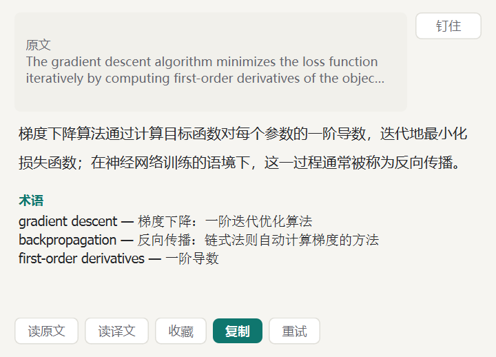
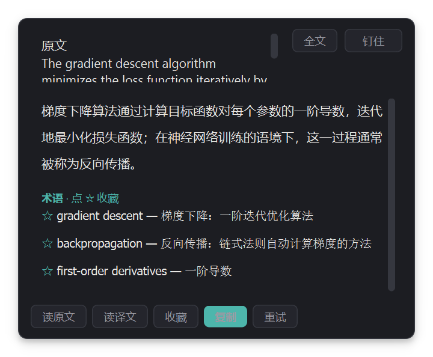

# CtrlTranslate

[](https://github.com/techdou/CtrlTranslate/actions/workflows/tests.yml)
[](https://github.com/techdou/CtrlTranslate/releases/latest)
[](LICENSE)

读英文文献/网页时的桌面划词翻译工具：**选中文字 → 双击 Ctrl → 弹窗流式翻译（大模型）**；图片/扫描件里的文字 **Alt+Q 框选截图，识别并翻译**。支持语音播报、生词本、翻译历史与 WebDAV 备份。Windows 平台，常驻系统托盘。

> 在线主页（截图 + 下载）：https://techdou.github.io/CtrlTranslate/

## 功能特性

- **双击 Ctrl 触发**——全局键盘钩子 + 状态机判定（与 Ctrl+C/V 等组合键不冲突），判定间隔 150–600 ms 可调，触发键可换 Alt / Shift，可整体停用
- **大模型流式翻译**——OpenAI 兼容协议，内置智谱 GLM Flash（免费、国内直连，默认推荐）、硅基流动、DeepSeek、OpenRouter、Gemini 预设，也可填任意兼容服务；打字机式逐字输出；**支持备用服务**：主服务失败（网络 / 限流 / Key 失效）时自动切换重发，无需手动换服务商
- **屏幕截图翻译（OCR）**——Alt+Q（可改可禁用）或托盘菜单触发，屏幕压暗后框选区域，多模态大模型识别图内文字并流式翻译 + 提术语（智谱 GLM-4V-Flash 免费，复用翻译的 API Key）；PDF 扫描件、图片、视频内文字都能翻；多屏与高 DPI 缩放适配
- **网页版引擎（免费额度）**——划词/截图可切换到内嵌网页版 AI（默认 DeepSeek，登录一次长期有效）：自动注入指令、读流式回复、Alt+Q 截图直接贴图识别、托盘开新会话/上传文档作上下文；无需 API Key，译文照常显示在本程序弹窗；需完整版构建（见开发）
- **灵动界面**——弹窗淡入上浮、流式译文窗口平滑生长、术语表在译文就位后渐次展开；等待首字时显示呼吸骨架屏而非干等；错误弹窗轻微抖动提醒；弹窗为真圆角 + 柔和投影的浮层质感；截图框选带 L 形角标与实时像素尺寸；原文预览超长时可一键「全文」展开滚动；术语/状态字号跟随正文设置
- **学习模式**——译文之外额外输出专业术语表（读文献场景友好），术语每行带 ☆ 可一键收藏进生词本；也支持仅译文的简洁模式，Prompt 可完全自定义
- **语音播报（TTS）**——读原文（练听力）或读译文；默认 edge-tts 在线音色（失败自动降级 Windows 系统语音），也可接入任意 OpenAI 兼容 TTS 接口（自定义 API 地址 + 模型 + 音色，如硅基流动 CosyVoice、OpenAI tts）；合成结果缓存，重复播报零等待
- **翻译缓存**——相同文本重复划词直接出结果，零请求零等待（点「重试」可强制重译）
- **生词本 + 翻译历史**——SQLite 本地存储，支持搜索、删除、导出 CSV（word/note/context 三列，可直接导入 Anki）；历史可按来源应用筛选；双击任意条目回看原文与译文（可朗读 / 复制 / 重译）
- **WebDAV 备份/恢复**——翻译历史 + 生词本一键备份到坚果云 / Nextcloud / NAS 等任意标准 WebDAV；恢复是合并导入，只增不删、重复自动跳过；备份为 JSON 快照（不备份可重建的翻译缓存）
- **双取词引擎自动降级**——优先 UI Automation 直读选中（不碰剪贴板），失败自动改用模拟复制法，并完整保存/恢复你的剪贴板
- **细节体验**——弹窗跟随鼠标、高度自适应、钉住防误关、失焦自动关闭、深/浅双主题、开机自启（免管理员）、单实例（再次启动自动唤醒已运行的实例并弹出设置窗）；内置代理设置（翻译 / TTS / OCR 共用，OpenRouter / Gemini 国内可用）；启动时自动检查 GitHub 新版本

## 界面预览

| 弹窗 · 浅色（学习模式：译文 + 术语表） | 弹窗 · 深色 |
|---|---|
|  |  |

## 快速开始

### 方式一：直接下载（推荐）

从 [Releases](https://github.com/techdou/CtrlTranslate/releases/latest) 下载 `CtrlTranslate.exe`（约 70 MB，单文件免安装），双击运行，程序常驻系统托盘（可能被折叠到托盘溢出区）。

自行打包（双构建：轻量版约 70MB 不含网页组件；完整版约 220MB 支持网页版引擎）：

```bat
pip install -r requirements.txt pyinstaller
build.bat          :: 轻量版 → dist\CtrlTranslate.exe
build-web.bat      :: 完整版 → dist\CtrlTranslate-Web.exe
```

### 方式二：源码运行

```bat
python -m venv .venv
.venv\Scripts\pip install -r requirements.txt
.venv\Scripts\python main.py
```

## 配置 API Key（首次使用必做）

托盘图标右键 → **设置… → 翻译服务**，选择服务商并填入 API Key（点击「测试连接」验证）：

| 服务商 | 费用 | 获取 Key |
|---|---|---|
| 智谱 AI（默认） | **免费**（GLM Flash 系列） | [bigmodel.cn](https://bigmodel.cn) |
| 硅基流动 SiliconFlow | 注册赠额 + 免费档 | [cloud.siliconflow.cn](https://cloud.siliconflow.cn) |
| DeepSeek | 低价 | [platform.deepseek.com](https://platform.deepseek.com) |
| OpenRouter | 含 `:free` 模型 | [openrouter.ai/keys](https://openrouter.ai/keys) |
| Google Gemini | 免费额度 | [aistudio.google.com](https://aistudio.google.com) |

> OpenRouter 与 Gemini 在国内直连不通，可在 设置 → 翻译服务 → 网络 中填入 HTTP 代理（如 `http://127.0.0.1:7890`），翻译与 TTS 共用。API Key 仅保存在本机 `~/.ctrltrans/config.json`，不会上传到任何地方。

## 使用方法

1. 启动后确认托盘菜单「启用双击 Ctrl 取词」已勾选（触发键可在 设置 → 触发与取词 中换 Alt / Shift）
2. 在浏览器 / PDF 中选中一段英文，快速双击 Ctrl（松开后触发）
3. 弹窗流式显示译文；按钮：读原文 / 读译文 / 收藏到生词本 / 复制 / 重试；「钉住」可防止点其他程序时弹窗关闭
4. Esc 或点击其他程序关闭弹窗

**屏幕截图翻译（OCR）**：按 Alt+Q（或托盘菜单 → 屏幕截图翻译），屏幕压暗后拖拽框选区域，松开即识别并翻译图内文字，Esc 取消。识别模型默认智谱 GLM-4V-Flash（免费，填了翻译 Key 即可用），可在 设置 → 触发与取词 中更换模型或热键。

**网页版引擎（免费额度）**：设置 → 翻译服务 → 勾选「网页版引擎」，首次使用在弹出的窗口登录 DeepSeek（一次即可）。之后划词与 Alt+Q 截图自动走网页免费额度，译文仍显示在原弹窗；托盘 → 网页翻译 可开新会话（清上下文）、上传文档（PDF/DOCX/TXT 等，作为后续翻译与问答的上下文）或手动对话。注意：该模式操作网页版界面，依赖站点页面结构（改版后需更新适配），仅供个人使用。

**生词进 Anki**：历史与生词本窗口右上角「导出 CSV」，三列 word/note/context，直接在 Anki 里「文件 → 导入」。

**WebDAV 备份**：设置 → 数据备份，填服务器地址 / 账号 / 密码（坚果云：账户信息 → 安全选项 → 添加**应用密码**，密码栏填它）。测试连接 → 立即备份；恢复为合并导入，只增不删。

## 故障排查

- **双击没反应**：确认托盘勾选；部分全屏/管理员权限程序收不到普通权限的键盘钩子，以管理员身份运行本程序可解
- **提示未取到选中文本**：需先真实选中一段文字；禁止复制的页面无法取词（属预期）
- **edge-tts 偶发 403 / 无声**：微软接口有反滥用限制，程序会自动降级系统语音；重试或更换网络通常可恢复
- **系统级复制粘贴全部失灵**：Windows 剪贴板服务偶发卡死，管理员 PowerShell 执行 `Restart-Service cbdhsvc*` 或重启机器
- **日志位置**：`~/.ctrltrans/logs/app.log`

数据（配置 / 数据库 / 日志 / 语音缓存）全部在 `~/.ctrltrans/`，卸载删除该目录即可彻底清理。

## 开发

```bat
.venv\Scripts\python -m pytest tests/ -q        :: 单元测试
```

技术栈：Python 3.10+ · PySide6 · openai SDK · edge-tts · keyboard · Win32 API（UIA / 剪贴板 / SendInput）

```
main.py            # 入口：单实例 + 服务组装
app/
  core/            # 热键 / 取词 / 翻译 / OCR / TTS / 生词本 / WebDAV 备份 / 自启
  ui/              # 翻译弹窗 / 截图遮罩 / 设置 / 历史生词本 / 托盘 / 主题
  db/              # SQLite 存储层
tests/             # 单元测试（GitHub Actions 自动运行）
scripts/           # 开发辅助（端到端测试 / 截图 / 图标生成 / 剪贴板修复）
assets/            # 应用图标 + 界面截图
site/              # GitHub Pages 项目主页
.github/workflows/ # CI（测试）/ Pages 部署
```

## 已知边界

- 仅支持 Windows（键盘钩子 / 剪贴板 / UIA / SAPI 均为 Win32 API）
- 剪贴板恢复覆盖文本 / HTML / 位图格式；文件列表（复制文件后划词）不恢复，日常划词场景几乎不涉及

## 版本历史

- **v1.3.0**（2026-09-09）——界面灵动化：弹窗动效（淡入上浮/骨架屏呼吸/流式平滑生长/术语渐次展开/错误微抖）、浮层阴影真圆角、截图框选 L 角标 + 像素尺寸徽标、原文「全文」展开、字号全局跟随；单实例升级为「唤醒已运行实例」；设置页补齐请求超时与朗读音量；西文字体改走 Segoe UI，深色主题下托盘菜单同步
- **v1.2.0**（2026-09-08）——屏幕截图 OCR 翻译（Alt+Q 框选，GLM-4V-Flash 免费）+ WebDAV 备份/恢复（坚果云 / NAS）
- **v1.1.0**（2026-09-07）——备用翻译服务自动切换、翻译缓存、术语 ☆ 收藏、来源筛选、自动检查更新
- **v1.0.0**（2026-09-06）——首个版本：双击 Ctrl 划词、流式翻译、学习模式术语表、语音播报、生词本与历史

## License

本项目基于 [MIT License](LICENSE) 协议开源。
